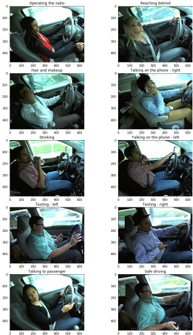
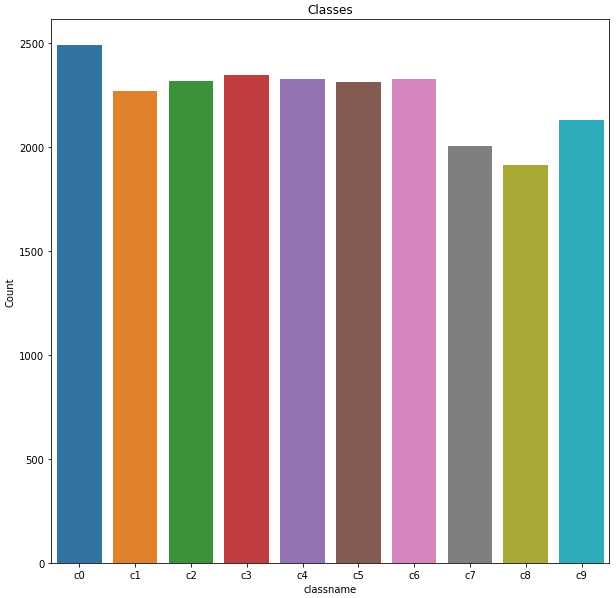
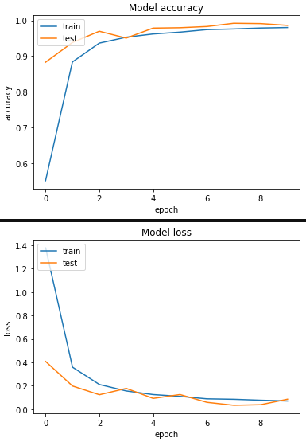
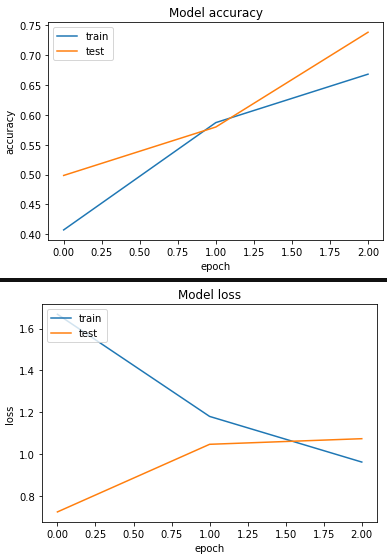
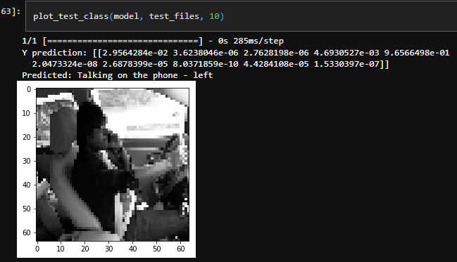
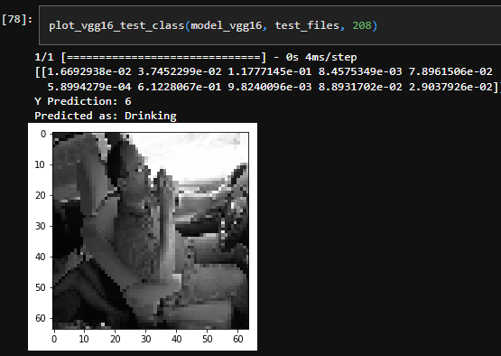

# Distracted Driver Detection

**Problem statement:**

The objective is to predict the driver's state based on the image provided to the model. The images in the dataset are sourced from State Farm. [State Farm](https://www.statefarm.com/) hopes to improve these alarming statistics, and better insure their customers, by testing whether dashboard cameras can automatically detect drivers engaging in distracted behaviors. Given a dataset of 2D dashboard camera images, State Farm is challenging Kagglers to classify each driver's behavior.

**Solution:**

Primarily this project deals with predicting the class/state of the driver. Hence, this is a classification task and CNN was the perfect model for this use case given the limited training resources and the simplicity of images. The jupyter notbook in the repository would explain my solution in detail to fit the model to identify and classify the instances to their respective classes.

**Pipeline:**
<ol>
<li>
  <b>Training data preparation:</b>
<ul>
  <li>
    <b>Image Preprocessing and Loading:</b> The code reads and preprocesses images from a specified directory using OpenCV, resizing them to uniform dimensions (<mark>img_rows</mark>, <mark>img_cols</mark>) and converting them to grayscale or color. Training data is organized into images (<mark>x_train</mark>) and corresponding labels (<mark>y_train</mark>) for each class, while test data is similarly loaded and normalized. </li>
  
  <li>
    <b>Data Normalization and Splitting:</b> Training data is split into training and validation sets using train_test_split, with labels converted to one-hot encoding for model compatibility. Test data is prepared and reshaped to ensure consistency with the input dimensions required by the model.
  </li>
  
  <li>A subset of test images is randomly sampled for evaluation, reshaped, and stored alongside their file IDs for further analysis or predictions.</li>
</ul>
</li>
 

<li>
<b>Exploratory Data Analysis:</b>
<ul>
  <li>
    Target variable classes:
  </li>
  
    
  <li>
    The bar chart shows the distribution of image counts across 10 classes (c0 to c9), indicating a fairly balanced dataset with slight variations in counts per class of distracted drivers, which is ideal for training a good classification model.
  </li>
  
</ul>
</li>

  
<li>
<b>Model Implementation:</b>
<ul>
  <li>
    <b>Optimized Vanilla CNN model:</b> The code implements an optimized Vanilla CNN with 3 convolutional blocks, dropout, and batch normalization, making it well-suited for robust multiclass classification.
  </li>
    
    Architecture: Optimized Vanilla CNN
    
    Layers: 3 Conv blocks, Dense layers
    
    Conv Filters: 32, 64, 128
    
    Pooling: MaxPooling (2x2)
    
    Regularization: BatchNorm, Dropout (0.3, 0.5)
    
    Activation: ReLU, Softmax (output)

  
    
  <li>
    <b>Transfer Learning VGG-16 model:</b> 
    
    Model Type: Transfer learning with VGG16  

    Pre-trained Layers: Frozen layers from VGG16 trained on ImageNet

    Custom Layers: GlobalAveragePooling2D, Dense (1024, ReLU), Dense (10, Softmax)
    
    Optimizer: RMSprop  
    
    Loss Function: Categorical crossentropy
  </li>
  
</ul>
</li>
  
<li>
  <b>Inference:</b>
  <ul>
    <li>In the optimized CNN model, We observe that the model started overfitting which led to the model classifying the test instances into wrong target classes.
    </li>
    <li>
      As an optimization to the overfitting, A transfer learning approach was implemented to the CNN Model and trained on the same image set.
    </li>
    <li>
      The test cases verified in the transfer learning model give accurate results and predict the activities of the drivers.
    </li>
  </ul>

 
 
</li>

</ol>
